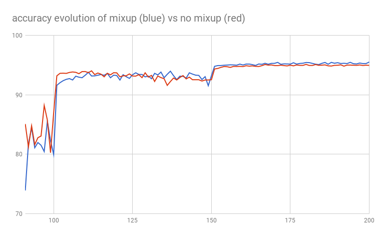
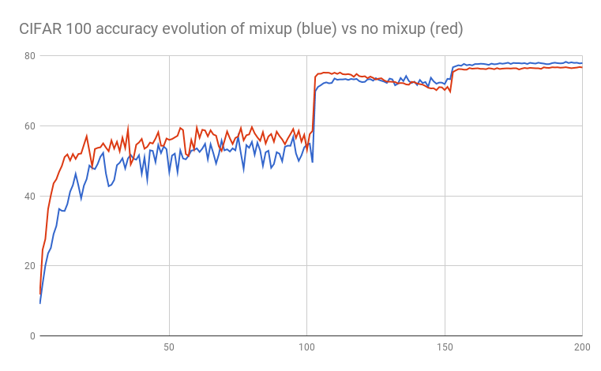

# Mixup: Beyond Empirical Risk Minimization in PyTorch

This is an unofficial PyTorch implementation of [mixup: Beyond Empirical Risk Minimization](https://arxiv.org/abs/1710.09412). The code is adapted from [PyTorch CIFAR](https://github.com/kuangliu/pytorch-cifar). 

## The results:

I only tested using CIFAR 10 and CIFAR 100. The network we used is PreAct ResNet-18. For mixup, we set alpha to be default value 1, meaning we sample the weight uniformly between zero and one. I trained 200 epochs for each setting. The learning rate is 0.1 (iter 1-100), 0.01 (iter 101-150) and 0.001 (iter 151-200). The batch size is 128. 

| Dataset and Model             | Acc.        |
| ----------------- | ----------- |
| CIFAR 10 no mixup              | 94.97%      |
| CIFAR 10 mixup          | 95.53%      |
| CIFAR 100 no mixup         | 76.53%      |
| CIFAR 100 mixup         | 77.83%      |

## CIFAR 10 test accuracy evolution

## CIFAR 100 test accuracy evolution


## Usage
```
# Train and test CIFAR 10 with mixup.
python main_cifar10.py --mixup --exp='cifar10_nomixup'
# Train and test CIFAR 10 without mixup.
python main_cifar10.py --exp='cifar10_nomixup'
# Train and test CIFAR 100 with mixup.
python main_cifar100.py --mixup --exp='cifar100_mixup'
# Train and test CIFAR 100 without mixup.
python main_cifar100.py --exp='cifar100_nomixup'
```
